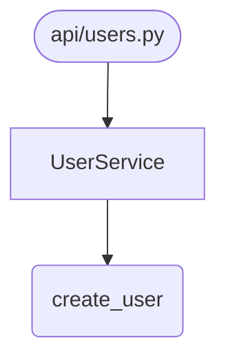

# Export Module - Multi-Format Graph Export

The export module provides a unified system for exporting MUbase graph data to multiple output formats: MU text (LLM-optimized), JSON (structured data), Mermaid (markdown diagrams), D2 (professional diagrams), and Cytoscape (interactive visualization).

## Architecture

```
MUbase Graph
      |
      v
ExportManager (registry)
      |
      +-- MUTextExporter    → .mu  (LLM consumption)
      +-- JSONExporter      → .json (tool integration)
      +-- MermaidExporter   → .mmd (markdown diagrams)
      +-- D2Exporter        → .d2  (professional diagrams)
      +-- CytoscapeExporter → .cyjs (interactive viz)
```

### Files

| File | Purpose |
|------|---------|
| `base.py` | Exporter Protocol, ExportOptions, ExportResult, ExportManager |
| `mu_text.py` | MU sigil format for LLM consumption |
| `json_export.py` | Structured JSON with schema |
| `mermaid.py` | Mermaid flowchart/classDiagram output |
| `d2.py` | D2 diagram language output |
| `cytoscape.py` | Cytoscape.js compatible JSON |
| `filters.py` | NodeFilter and EdgeFilter utilities |

## Data Models

### ExportOptions

Common options for all exporters:

```python
@dataclass
class ExportOptions:
    node_ids: list[str] | None = None      # Filter specific nodes
    node_types: list[NodeType] | None = None  # Filter by type
    max_nodes: int | None = None           # Limit for diagrams
    include_edges: bool = True             # Include relationships
    pretty: bool = True                    # Pretty-print output
```

### ExportResult

Return type with error-as-data pattern:

```python
@dataclass
class ExportResult:
    content: str                           # Exported content
    format: str                            # Format name
    node_count: int
    edge_count: int
    error: str | None = None               # Error if failed

    @property
    def success(self) -> bool:
        return self.error is None
```

## Exporter Protocol

All exporters implement this interface:

```python
@runtime_checkable
class Exporter(Protocol):
    @property
    def format_name(self) -> str: ...

    @property
    def file_extension(self) -> str: ...

    def export(
        self,
        mubase: MUbase,
        options: ExportOptions | None = None,
    ) -> ExportResult: ...
```

## Usage

### Python API

```python
from mu.kernel import MUbase
from mu.kernel.export import (
    ExportManager, ExportOptions, get_default_manager,
    MUTextExporter, JSONExporter, MermaidExporter
)

db = MUbase(Path(".mubase"))

# Using ExportManager
manager = get_default_manager()
result = manager.export(db, "mu")
print(result.content)

# With options
options = ExportOptions(
    node_types=[NodeType.CLASS, NodeType.FUNCTION],
    max_nodes=50
)
result = manager.export(db, "mermaid", options)

# Using exporter directly
exporter = MUTextExporter()
result = exporter.export(db)
```

### CLI Commands

```bash
# Export full graph as MU format
mu kernel export . --format mu > system.mu

# Export as JSON
mu kernel export . --format json -o graph.json

# Export specific types as Mermaid
mu kernel export . --format mermaid --types class,function

# Export with node limit as D2
mu kernel export . --format d2 --max-nodes 50 --direction down

# Export for Cytoscape visualization
mu kernel export . --format cytoscape -o viz.cyjs

# List available formats
mu kernel export --list-formats
```

## Format Details

### MU Text (.mu)

LLM-optimized sigil format:

```
! src/api/users.py
  $ UserService
    # create_user(name: str, email: str) -> User
    # get_user(id: int) -> User | None :: @cache
  @ models, validators

! src/models/user.py
  $ User < BaseModel
    # __init__(name, email)
    # to_dict() -> dict
```

Sigils:
- `!` Module
- `$` Class (with `<` for inheritance)
- `#` Function/Method
- `@` Dependencies
- `::` Annotations
- `->` Return type
- `=>` State mutation

### JSON (.json)

Structured graph data:

```json
{
  "version": "1.0",
  "generated_at": "2024-01-01T00:00:00",
  "stats": {"node_count": 42, "edge_count": 87},
  "nodes": [...],
  "edges": [...]
}
```

### Mermaid (.mmd)

Markdown-embeddable diagrams:



Supports `flowchart` and `classDiagram` types.

### D2 (.d2)

Professional diagram language:

```d2
direction: right

mod_users: M api/users.py { shape: package }
cls_service: C UserService { shape: class }

mod_users -> cls_service: contains
```

### Cytoscape (.cyjs)

Interactive visualization JSON:

```json
{
  "elements": {
    "nodes": [{"data": {"id": "...", "label": "...", "type": "..."}}],
    "edges": [{"data": {"source": "...", "target": "..."}}]
  },
  "style": [...]
}
```

## Best Practices

1. **Use max_nodes for diagrams**: Mermaid and D2 become unreadable with too many nodes
2. **Filter by type for focused views**: `--types class` for architecture diagrams
3. **Use MU format for LLMs**: Most token-efficient representation
4. **Use JSON for tool integration**: Schema-compliant, machine-readable

## Anti-Patterns

1. **Never** modify MUbase during export - exporters are read-only
2. **Never** raise exceptions for expected failures - use ExportResult.error
3. **Never** hardcode node type strings - use NodeType enum
4. **Never** export without size limits for large graphs

## Testing

```bash
pytest tests/unit/test_export.py -v
```

Test coverage includes:
- All exporter format outputs
- Filtering by node_ids and node_types
- Edge cases (empty graphs, special characters)
- ExportManager registration and dispatch
