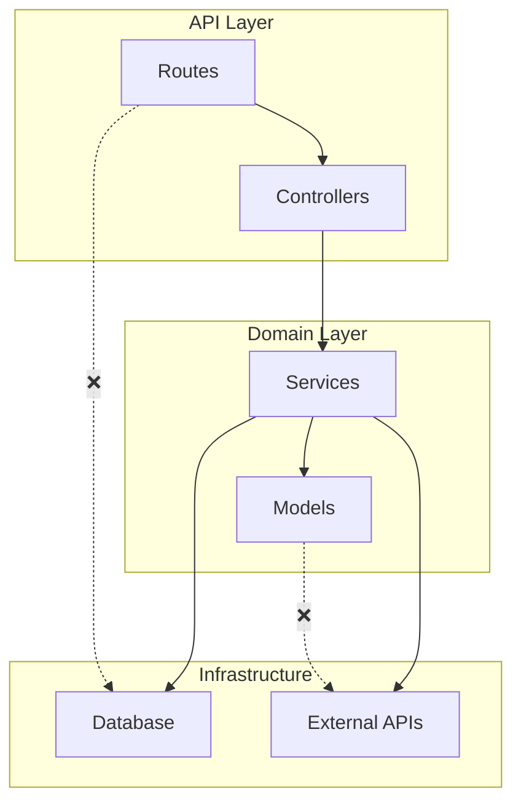

# Contracts Resurrection Roadmap

**Status:** Future (Post-Trimming)
**Priority:** P2 - Nice to Have
**Author:** Claude + imu
**Created:** 2025-12-09

## Executive Summary

Architecture contracts were deleted in Phase 1 trimming because they were half-built and unused. This roadmap outlines how to bring them back as a properly integrated, "divine" feature that developers actually use.

## Why Contracts Failed (v1)

1. **No automatic enforcement** - Manual `mu contracts verify` meant nobody ran it
2. **No CI integration** - Violations weren't caught in PR reviews
3. **No pre-commit hooks** - Bad code merged before anyone noticed
4. **Poor discoverability** - Users didn't know the feature existed
5. **No visual feedback** - Violations were plain text dumps
6. **YAML-only config** - No code-as-contracts option

## The Divine Vision (v2)

Contracts v2 should be:
- **Zero-friction** - Works automatically without user action
- **IDE-integrated** - Red squiggles in your editor
- **CI-native** - PR checks that block bad architecture
- **Self-documenting** - Contracts generate architecture docs
- **AI-assisted** - LLM suggests contracts from existing patterns

---

## Feature Roadmap

### Phase 1: Foundation (Week 1-2)

#### 1.1 Contract Schema v2

```yaml
# .mu/contracts.yml
version: "2.0"

layers:
  - name: api
    paths: ["src/api/**", "src/routes/**"]
    can_import: [domain, infrastructure]
    cannot_import: [cli, scripts]

  - name: domain
    paths: ["src/domain/**", "src/models/**"]
    can_import: [shared]
    cannot_import: [api, infrastructure, cli]

  - name: infrastructure
    paths: ["src/db/**", "src/external/**"]
    can_import: [domain, shared]
    cannot_import: [api, cli]

boundaries:
  - name: no-circular-deps
    rule: "layers cannot have circular dependencies"
    severity: error

  - name: domain-purity
    rule: "domain layer has no external dependencies"
    severity: error

naming:
  - pattern: "src/services/*Service.py"
    rule: "Service classes must end with 'Service'"
    severity: warning

  - pattern: "src/repositories/*Repository.py"
    rule: "Repository classes must end with 'Repository'"
    severity: warning

custom:
  - name: no-orm-in-api
    query: |
      SELECT f.path FROM functions f
      JOIN imports i ON f.module_id = i.module_id
      WHERE f.path LIKE 'src/api/%'
      AND i.module LIKE '%sqlalchemy%'
    message: "API layer should not import ORM directly"
    severity: error
```

#### 1.2 Core Validator Rewrite

```python
# src/mu/contracts/validator.py

class ContractValidator:
    """Validates code against architectural contracts."""

    def __init__(self, mubase: MUbase, contracts: ContractConfig):
        self.mubase = mubase
        self.contracts = contracts

    def validate(self, files: list[str] | None = None) -> ValidationResult:
        """Validate files against all contracts.

        Args:
            files: Specific files to check (None = all files)

        Returns:
            ValidationResult with violations and suggestions
        """
        violations = []

        # Layer violations
        violations.extend(self._check_layers(files))

        # Boundary violations
        violations.extend(self._check_boundaries(files))

        # Naming violations
        violations.extend(self._check_naming(files))

        # Custom MUQL rules
        violations.extend(self._check_custom_rules(files))

        return ValidationResult(
            valid=len([v for v in violations if v.severity == "error"]) == 0,
            violations=violations,
            checked_files=files or self._get_all_files(),
        )
```

---

### Phase 2: Automatic Enforcement (Week 3-4)

#### 2.1 Pre-commit Hook

```bash
# .pre-commit-config.yaml integration
repos:
  - repo: local
    hooks:
      - id: mu-contracts
        name: MU Architecture Contracts
        entry: mu contracts check --staged
        language: system
        pass_filenames: false
        stages: [commit]
```

**CLI command:**
```bash
# Check staged files only (fast)
mu contracts check --staged

# Check all files
mu contracts check

# Check specific files
mu contracts check src/api/users.py src/api/auth.py

# Auto-fix where possible (rename suggestions)
mu contracts check --fix
```

#### 2.2 GitHub Action

```yaml
# .github/workflows/contracts.yml
name: Architecture Contracts

on:
  pull_request:
    branches: [main, develop]

jobs:
  contracts:
    runs-on: ubuntu-latest
    steps:
      - uses: actions/checkout@v4

      - name: Setup MU
        run: pip install mu-code

      - name: Build Graph
        run: mu build

      - name: Check Contracts
        run: mu contracts check --format github

      - name: Post PR Comment
        if: failure()
        uses: actions/github-script@v7
        with:
          script: |
            const violations = require('./mu-violations.json');
            // Post formatted comment with violations
```

#### 2.3 MCP Integration

```python
@mcp.tool()
def mu_contracts_check(
    files: list[str] | None = None,
    staged: bool = False,
) -> ContractsCheckResult:
    """Check files against architecture contracts.

    Validates that code follows defined architectural rules:
    - Layer dependencies (API can't import CLI)
    - Naming conventions (Services end with 'Service')
    - Custom MUQL rules

    Args:
        files: Specific files to check (None = all)
        staged: Only check git staged files

    Returns:
        ContractsCheckResult with violations and fix suggestions
    """
```

---

### Phase 3: IDE Integration (Week 5-6)

#### 3.1 LSP Server

```python
# src/mu/lsp/server.py

class MULanguageServer:
    """Language Server Protocol implementation for MU contracts."""

    def __init__(self):
        self.validator = ContractValidator(...)

    async def on_did_save(self, params: DidSaveTextDocumentParams):
        """Validate on file save."""
        violations = self.validator.validate([params.text_document.uri])

        diagnostics = [
            Diagnostic(
                range=Range(v.line_start, 0, v.line_end, 100),
                message=v.message,
                severity=DiagnosticSeverity.Error if v.severity == "error"
                         else DiagnosticSeverity.Warning,
                source="mu-contracts",
                code=v.rule,
            )
            for v in violations
        ]

        self.publish_diagnostics(params.text_document.uri, diagnostics)
```

#### 3.2 VS Code Extension

```json
// package.json
{
  "name": "mu-contracts",
  "displayName": "MU Architecture Contracts",
  "description": "Real-time architecture validation",
  "categories": ["Linters"],
  "activationEvents": ["workspaceContains:.mu/contracts.yml"],
  "contributes": {
    "configuration": {
      "mu-contracts.enable": true,
      "mu-contracts.validateOnSave": true,
      "mu-contracts.validateOnType": false
    }
  }
}
```

**User experience:**
- Red squiggles on import violations
- Hover shows violation message + fix suggestion
- Quick fix: "Move to correct layer" / "Rename to convention"
- Status bar shows contract status

---

### Phase 4: AI-Assisted Contracts (Week 7-8)

#### 4.1 Contract Inference

```python
@mcp.tool()
def mu_contracts_infer() -> InferredContracts:
    """Infer architecture contracts from existing codebase.

    Analyzes the codebase to suggest contracts based on:
    - Detected patterns (from mu_patterns)
    - Import graph structure
    - Naming conventions in use
    - Directory structure

    Returns:
        InferredContracts with suggested rules and confidence scores
    """
```

**Example output:**
```yaml
# Inferred contracts (confidence: 0.87)
layers:
  - name: api
    paths: ["src/api/**"]
    inferred_from: "Directory structure + no reverse imports"
    confidence: 0.92

  - name: services
    paths: ["src/services/**"]
    inferred_from: "All files end with 'Service'"
    confidence: 0.95

naming:
  - pattern: "*Service.py"
    rule: "Classes end with 'Service'"
    inferred_from: "23/24 files follow this pattern"
    confidence: 0.96
```

#### 4.2 Violation Explanations

```python
@mcp.tool()
def mu_contracts_explain(violation_id: str) -> ContractExplanation:
    """Explain why a contract violation matters.

    Uses LLM to generate human-friendly explanations:
    - Why this rule exists
    - What could go wrong if violated
    - How to fix it properly
    - Examples of correct code
    """
```

#### 4.3 Auto-Fix Suggestions

```python
@mcp.tool()
def mu_contracts_fix(
    file_path: str,
    violation_id: str,
) -> ContractFix:
    """Generate fix for a contract violation.

    Returns:
        ContractFix with:
        - Suggested code changes
        - New file location (if move needed)
        - Import updates required
    """
```

---

### Phase 5: Documentation Generation (Week 9-10)

#### 5.1 Architecture Diagrams

```bash
# Generate architecture diagram from contracts
mu contracts diagram --format mermaid > architecture.md
mu contracts diagram --format d2 > architecture.d2
mu contracts diagram --format excalidraw > architecture.excalidraw
```

**Example output:**


#### 5.2 Contract Documentation

```bash
# Generate markdown docs from contracts
mu contracts docs > ARCHITECTURE.md
```

**Example output:**
```markdown
# Architecture Contracts

## Layers

### API Layer (`src/api/**`)
- **Can import:** Domain, Infrastructure
- **Cannot import:** CLI, Scripts
- **Purpose:** HTTP request handling, validation, response formatting

### Domain Layer (`src/domain/**`)
- **Can import:** Shared only
- **Cannot import:** API, Infrastructure, CLI
- **Purpose:** Business logic, domain models, pure functions

## Rules

### no-circular-deps (Error)
Layers cannot have circular dependencies. This prevents...

### domain-purity (Error)
Domain layer has no external dependencies. This ensures...
```

---

## Success Metrics

| Metric | Target |
|--------|--------|
| Pre-commit adoption | 80% of repos with contracts use hooks |
| CI integration | 90% of PRs checked automatically |
| Violation fix rate | 70% of violations fixed within 24h |
| False positive rate | < 5% |
| User satisfaction | 4.5/5 rating |

## Technical Requirements

- **Performance:** Validate 1000 files in < 5 seconds
- **Incremental:** Only re-check changed files
- **Caching:** Cache graph queries for repeated checks
- **Parallel:** Multi-threaded validation

## Dependencies

- MUbase graph (required)
- Git (for staged file detection)
- LSP protocol (for IDE integration)
- LLM API (for AI features, optional)

## Risks & Mitigations

| Risk | Mitigation |
|------|------------|
| Too strict = developer friction | Severity levels (error/warning/info) |
| Too loose = no value | Start with inferred contracts |
| Performance issues | Incremental validation, caching |
| Complex configuration | Sensible defaults, inference |

---

## Implementation Priority

1. **Must Have (MVP)**
   - Contract schema v2
   - Core validator
   - Pre-commit hook
   - `mu contracts check` CLI

2. **Should Have**
   - GitHub Action
   - MCP tool
   - Basic diagram generation

3. **Nice to Have**
   - LSP server
   - VS Code extension
   - Contract inference
   - Auto-fix suggestions

4. **Future**
   - Multi-repo contracts
   - Contract inheritance
   - Contract marketplace

---

## References

- [ArchUnit](https://www.archunit.org/) - Java architecture testing
- [dependency-cruiser](https://github.com/sverweij/dependency-cruiser) - JS dependency validation
- [Nx boundaries](https://nx.dev/core-features/enforce-module-boundaries) - Monorepo boundaries
- [Deptrac](https://qossmic.github.io/deptrac/) - PHP layer dependencies

---

## Git History Reference

The original contracts implementation can be found in git history:
```bash
git log --all --full-history -- src/mu/contracts/
git show <commit>:src/mu/contracts/validator.py
```
